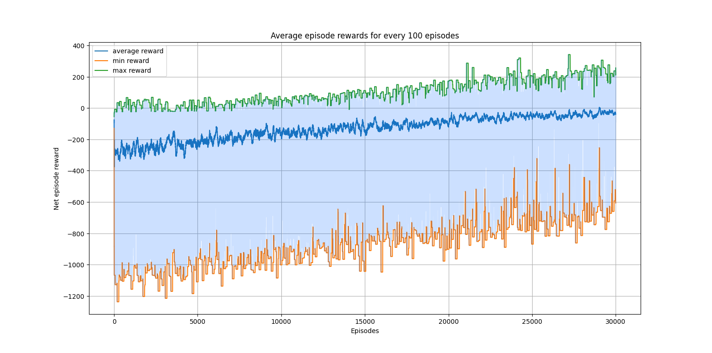

# OELP
## Control Designs for Autonomous Vehicles based on Reinforcement Learning

Developing control designs for autonomous vehicles
based on reinforcement learning. Control designs include discrete
and continuous action space based designs with emphasis on
learning from interaction with an environment in order to achieve
goals instead of handcrafted control strategies. Control Designs
have to be adaptable to the environment. Training and testing
simulations are to be performed in python.

---------------
`requirements.txt` can be used to create a pip virtual environment
```
python3 -m venv env
source env/bin/activate
pip install -r requirements.txt
```
## Path Editor

<p align="center">

</p>
<p align="center">Path Editor Demo</p>

## Q-learning

<p align="center">

</p>
<p align="center">Q-learning agent on straight track</p>

<p align="center">

</p>
<p align="center">Q-learning agent on curved track</p>

## Deep Q-learning

<p align="center">

</p>
<p align="center">Deep Q-learning agent on straight track</p>

<p align="center">

</p>
<p align="center">Deep Q-learning agent on curved track</p>

## Results

<table>
    <tr>
        <p align="center">
        
        </p>
        <p align="center">
        Q-learning agent on straight track
        </p>
    </tr> 
    <tr>
        <p align="center">
        
        </p>
        <p align="center">Deep Q-learning agent on straight track</p>
    </tr>
    <tr>
        <p align="center">
        
        </p>
        <p align="center">Deep Q-learning agent on curved track</p">
    </tr>
</table>

[Final Report](report.pdf)